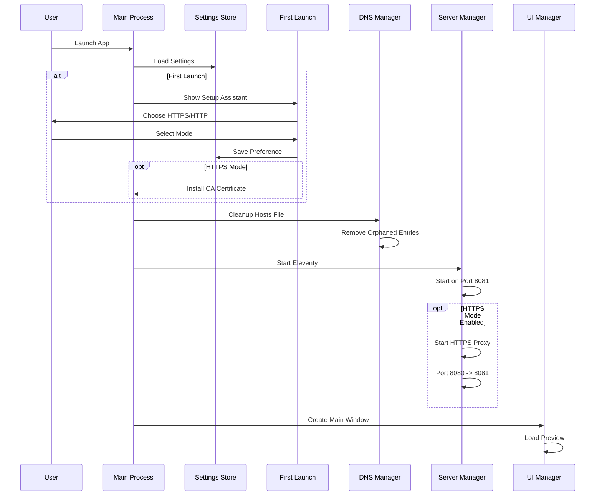
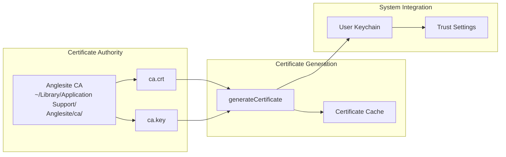
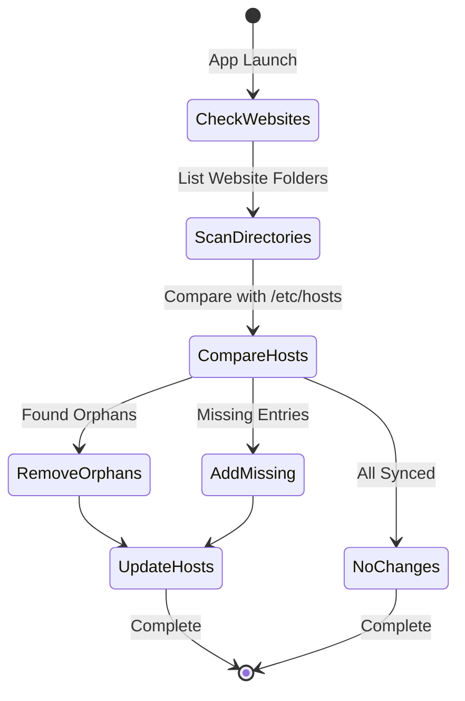
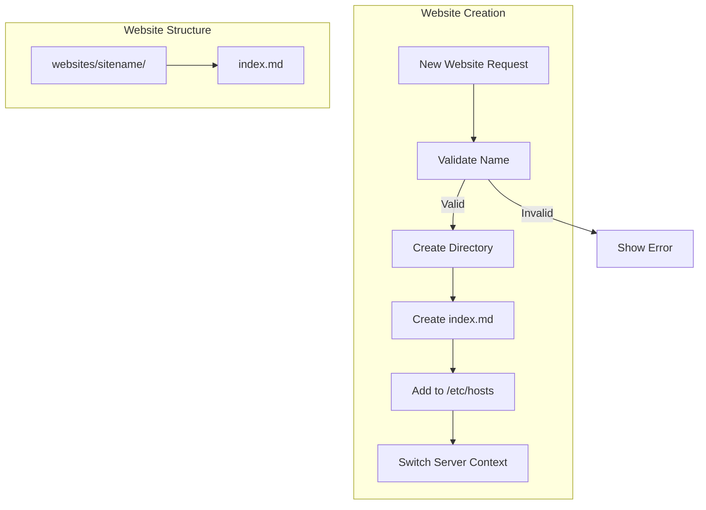
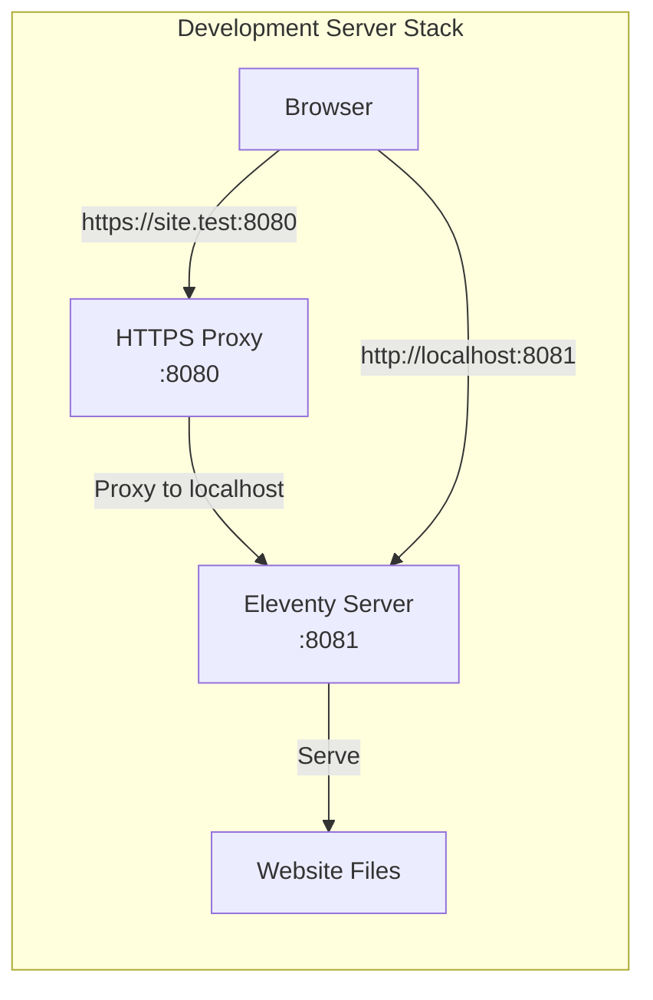
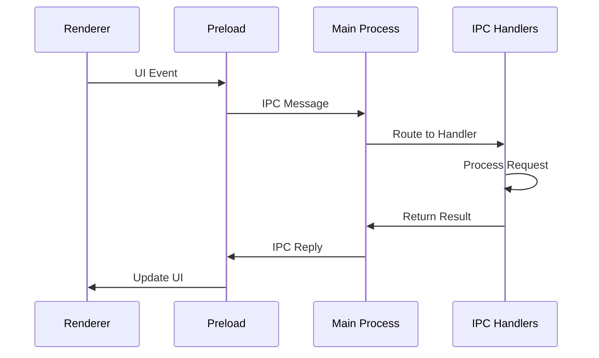
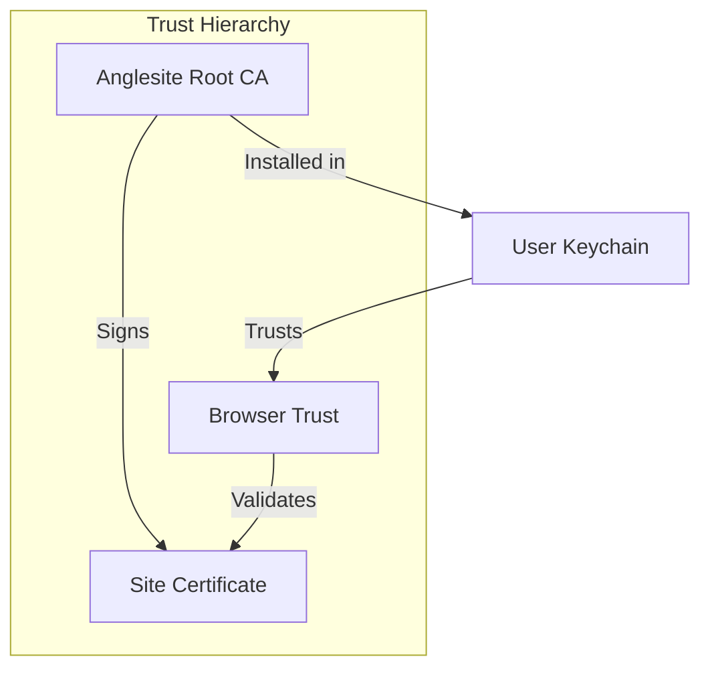
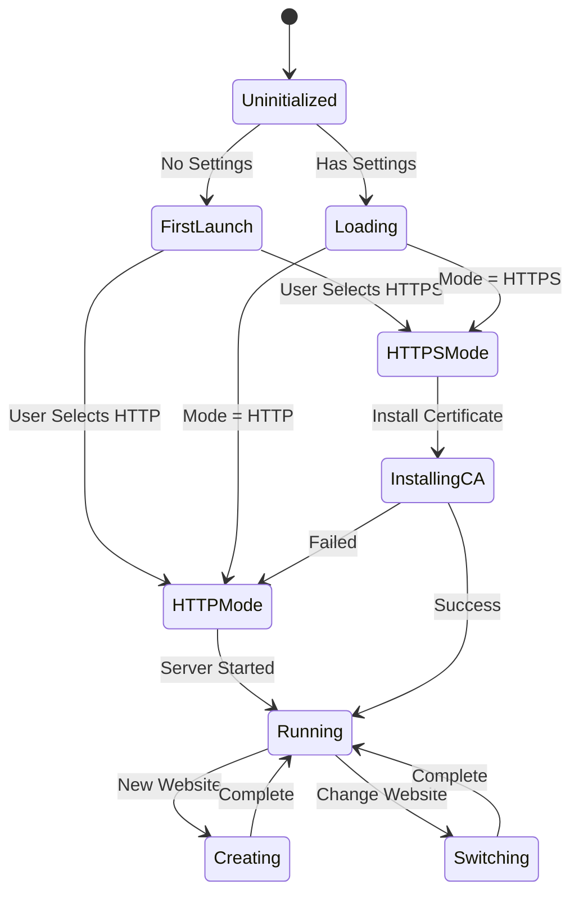
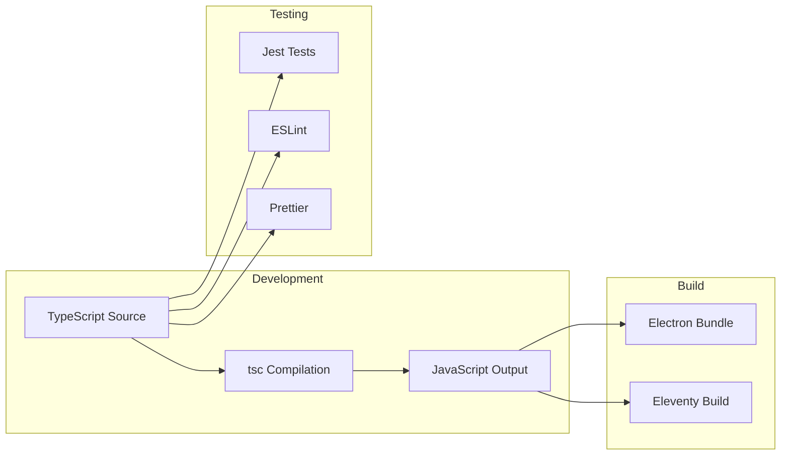

# Anglesite Architecture

Anglesite is a local-first, Electron-based static site generator that combines Eleventy's powerful site generation with a native desktop application experience. This document describes the current architecture and design decisions.

## System Overview

```mermaid
graph TB
    subgraph "Electron Main Process"
        Main[main.ts]
        Store[Store<br/>Settings Management]
        Cert[Certificate Manager]
        DNS[DNS/Hosts Manager]
        Server[Server Manager]
        IPC[IPC Handlers]
    end

    subgraph "Electron Renderer Process"
        UI[UI/Window Manager]
        Menu[Application Menu]
        Preview[WebContentsView<br/>Preview]
    end

    subgraph "External Services"
        Eleventy[Eleventy Server<br/>Port 8081]
        HTTPS[HTTPS Proxy<br/>Port 8080]
        Hosts[/etc/hosts]
        Keychain[System Keychain]
    end

    Main --> Store
    Main --> Cert
    Main --> DNS
    Main --> Server
    Main --> IPC

    IPC <--> UI
    UI --> Preview
    UI --> Menu

    Server --> Eleventy
    Server --> HTTPS
    DNS --> Hosts
    Cert --> Keychain

    HTTPS --> Eleventy
    Preview --> HTTPS
```

## Directory Structure

```text
anglesite/
├── app/                        # Electron application source
│   ├── main.ts                 # Main process entry point
│   ├── preload.ts              # Preload script for renderer
│   ├── renderer.ts             # Renderer process code
│   ├── index.html              # Main window HTML
│   ├── styles.css              # Application styles
│   ├── store.ts                # Persistent settings storage
│   ├── certificates.ts         # CA and SSL certificate management
│   │
│   ├── dns/                    # DNS management
│   │   └── hosts-manager.ts    # /etc/hosts file management
│   │
│   ├── server/                 # Server components
│   │   ├── eleventy.ts         # Eleventy server management
│   │   ├── https-proxy.ts      # HTTPS proxy server
│   │   └── index.ts            # Server module exports
│   │
│   ├── ui/                     # User interface components
│   │   ├── window-manager.ts   # Window and WebContentsView
│   │   ├── menu.ts             # Application menu
│   │   ├── first-launch.html   # First launch assistant
│   │   └── index.ts            # UI module exports
│   │
│   ├── ipc/                    # Inter-process communication
│   │   └── handlers.ts         # IPC message handlers
│   │
│   ├── utils/                  # Utility functions
│   │   └── website-manager.ts  # Website creation/management
│   │
│   └── eleventy/               # Eleventy configuration
│       ├── .eleventy.js        # Eleventy config
│       ├── includes/           # Layout templates
│       └── src/                # Default content
│
├── dist/                       # Compiled output
│   ├── app/                    # Compiled TypeScript
│   └── [site files]            # Built static site
│
├── docs/                       # Project documentation
├── test/                       # Test files
├── bin/                        # Legacy shell scripts
└── package.json                # Dependencies and scripts
```

## Core Components

### 1. Application Initialization Flow



### 2. Certificate Management

The certificate system uses the `mkcert` npm package to generate trusted SSL certificates:



**Key Features:**

- Self-contained CA generation
- Certificate caching for performance
- User keychain installation (no admin required)
- Fallback to HTTP if certificate issues

### 3. DNS and Hosts Management



**Automatic Management:**

- Scans `~/Library/Application Support/Anglesite/websites/`
- Maintains Anglesite section in `/etc/hosts`
- Removes orphaned .test domains
- Adds new website domains automatically
- Preserves system entries outside Anglesite section

### 4. Website Management



### 5. Server Architecture



**Dual Mode Support:**

- **HTTPS Mode**: Browser → HTTPS Proxy (:8080) → Eleventy (:8081)
- **HTTP Mode**: Browser → Eleventy (:8081) directly
- Hot reload via Eleventy's built-in WebSocket

## Data Flow

### IPC Communication



**Key IPC Channels:**

- `new-website`: Create new website
- `preview`: Show preview window
- `toggle-devtools`: Toggle developer tools
- `build`: Trigger site build
- `open-browser`: Open in external browser

## Security Architecture

### Certificate Trust Model



### Permission Model

1. **File System Access**

   - Application data: `~/Library/Application Support/Anglesite/`
   - Website storage: Isolated in app data
   - No access to user documents without explicit action

2. **Network Security**

   - Local-only servers (127.0.0.1)
   - No external network access
   - HTTPS certificates for .test domains only

3. **System Integration**
   - Hosts file modification requires sudo
   - Certificate installation in user keychain
   - No system-wide changes without consent

## State Management



## Performance Optimizations

1. **Certificate Caching**

   - In-memory cache for generated certificates
   - Avoids regenerating for same domains

2. **Lazy Loading**

   - WebContentsView created once, reused
   - Eleventy server persists between site switches

3. **Hosts File Management**
   - Batch operations for multiple domains
   - Single sudo prompt for all changes

## Future Architecture Considerations

### Planned Improvements

1. **Plugin System**

   - Extensible Eleventy configurations
   - Custom build pipelines
   - Third-party integrations

2. **Multi-Site Management**

   - Concurrent site editing
   - Site templates and themes
   - Import/export functionality

3. **Deployment Integration**
   - Direct deploy to hosting services
   - Git integration
   - CI/CD pipeline support

### Scalability Considerations

- **Website Limit**: Currently unlimited (filesystem constrained)
- **Performance**: Handles 100+ websites efficiently
- **Memory Usage**: ~150MB baseline, scales with preview content
- **Certificate Management**: Cached, 365-day validity

## Development Workflow



## Conclusion

Anglesite's architecture prioritizes:

- **Simplicity**: Minimal configuration, works out of the box
- **Security**: Sandboxed, local-only, user-controlled
- **Performance**: Efficient resource usage, fast preview updates
- **Extensibility**: Modular design allows for future growth

The architecture successfully balances the power of Eleventy with the convenience of a desktop application, providing a seamless local development experience for static sites.
