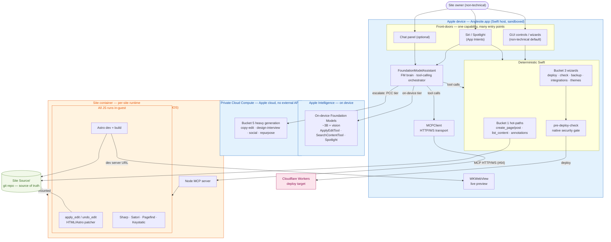

# Anglesite — Desired Application Architecture

The end-state after the [Claude Code removal roadmap](superpowers/specs/2026-06-20-claude-code-removal-roadmap-design.md):
no `claude` binary, deterministic Swift + Apple Intelligence only, and all JavaScript
running **inside the per-site container** rather than as a host-spawned process.

This diagram shows the trust / execution boundaries — what runs on the Apple device, what
runs in Apple's Private Cloud Compute, what runs inside the site container, and where the
filesystem source of truth and the deploy target sit.

```mermaid
flowchart TB
    user(["Site owner (non-technical)"])

    subgraph device["Apple device — Anglesite.app (Swift host, sandboxed)"]
        direction TB
        subgraph frontdoors["Front-doors — one capability, many entry points"]
            gui["GUI controls / wizards<br/>(non-technical default)"]
            siri["Siri / Spotlight<br/>(App Intents)"]
            chat["Chat panel (optional)"]
        end
        fmbrain["FoundationModelAssistant<br/>FM brain · tool-calling orchestrator"]
        subgraph swift["Deterministic Swift"]
            b1["Bucket 1 hot-paths<br/>create_page/post · list_content · annotations"]
            b3["Bucket 3 wizards<br/>deploy · check · backup · integrations · themes"]
            gate["pre-deploy-check<br/>native security gate"]
        end
        mcpclient["MCPClient<br/>HTTP/WS transport"]
        webview["WKWebView<br/>live preview"]
    end

    subgraph ai["Apple Intelligence — on device"]
        ondevice["On-device Foundation Models<br/>~3B + vision<br/>ApplyEditTool · SearchContentTool · Spotlight"]
    end

    subgraph pcc["Private Cloud Compute — Apple cloud, no external APIs"]
        pccgen["Bucket 5 heavy generation<br/>copy-edit · design-interview · social · repurpose"]
    end

    subgraph container["Site container — per-site runtime<br/>(Apple Containerization on macOS · Cloudflare remote/iOS)"]
        direction TB
        mcpserver["Node MCP server"]
        subgraph js["All JS runs in-guest"]
            applyedit["apply_edit / undo_edit<br/>HTML/Astro patcher"]
            astro["Astro dev + build"]
            media["Sharp · Satori · Pagefind · Keystatic"]
        end
    end

    repo[("Site Source/<br/>git repo — source of truth")]
    cf["Cloudflare Workers<br/>deploy target"]

    user --> gui & siri & chat
    gui --> swift
    siri --> swift
    siri --> fmbrain
    chat --> fmbrain
    fmbrain -->|on-device tier| ondevice
    fmbrain -->|escalate: PCC tier| pccgen
    fmbrain -->|tool calls| swift
    fmbrain -->|tool calls| mcpclient
    b1 --> repo
    b3 --> gate
    mcpclient -->|"MCP HTTP/WS (#64)"| mcpserver
    mcpserver --> js
    applyedit --> repo
    astro --> repo
    repo -. mounted .-> container
    astro -->|dev server URL| webview
    gate -->|deploy| cf

    classDef appleTrust fill:#e3f2fd,stroke:#1565c0,color:#0d47a1;
    classDef containerBound fill:#fff3e0,stroke:#e65100,color:#e65100;
    classDef external fill:#fce4ec,stroke:#ad1457,color:#880e4f;
    classDef store fill:#f1f8e9,stroke:#558b2f,color:#33691e;
    class device,ai,pcc appleTrust;
    class container,js containerBound;
    class cf external;
    class repo store;
```

## Boundaries

| Boundary | What's inside | How it's crossed |
|---|---|---|
| **Apple device (host)** | The Swift app: front-doors (GUI / Siri / chat), the `FoundationModelAssistant` orchestrator, deterministic Swift (Bucket 1 hot-paths + Bucket 3 wizards), the native `pre-deploy-check` gate, `MCPClient`, and the `WKWebView` preview. | User input; in-process Apple Intelligence API; `MCPClient` to the container. |
| **Apple Intelligence (on-device)** | The ~3B on-device Foundation Models + vision, with the registered FM `Tool`s (`ApplyEditTool`, `SearchContentTool`, Spotlight). | Called in-process by the FM brain; never leaves the device. |
| **Private Cloud Compute** | Heavy generation that exceeds the on-device ceiling (Bucket 5: copy-edit, design-interview, social, repurpose). Apple-operated. **Not wired yet:** the `.privateCloudCompute` tier is backed by the on-device session until the PCC entitlement lands (see `2026-07-10-pcc-escalation-spike-notes.md`). External LLMs are **not** part of this boundary: per the revised LLM policy (2026-07-08) they exist only as an explicit Settings opt-in (`ExternalLLMBackend`, ACP agents) for the chat panel. | The FM brain escalates to the PCC tier over Apple's attested, encrypted channel. |
| **Site container (per-site)** | **All JavaScript**: the Node MCP server and everything it drives in-guest — `apply_edit`/`undo_edit` (HTML/Astro patcher), the Astro dev server + build, Sharp, Satori, Pagefind, Keystatic. Apple Containerization is the macOS runtime direction; Cloudflare Sandbox is the remote/iOS runtime. | The host reaches it only over the in-container **MCP HTTP/WS transport** (#64) — not by host-spawning Node. |
| **Site `Source/` (git repo)** | The filesystem source of truth — the clonable, externally-editable unit. | Mounted into the container; written by the in-guest JS and by Swift Bucket-1 hot-paths; read by `WKWebView` via the dev server. |
| **Cloudflare (deploy target)** | The published site (Workers). | Deploy runs only after the native `pre-deploy-check` gate passes. |

## First-party infrastructure

Decision D7 (`specs/2026-09-08-product-direction-review-decisions.md`): the app is not a pure
desktop client. It depends on a small set of services Anglesite operates — everything under and
including `anglesite.dwk.io`, plus the `@dwk/workers` catalog — and these are accepted, documented
first-party dependencies rather than incidental ones. They do not appear in the diagram above
because none of them sits on the content path: the site's `Source/` repo and the deploy to
Cloudflare work without them, and every one degrades rather than blocks when unreachable.

| Dependency | What the app uses it for | Trust posture |
|---|---|---|
| **`auth.anglesite.dwk.io`** | The Cloudflare OAuth callback (`CloudflareOAuthClient.redirectURI` → `/oauth-callback`) and the AT Protocol OAuth client metadata (`ATProtoOAuthClient.clientID` → `/atproto/client-metadata.json`). It relays authorization codes back to the app; it never holds a long-lived token. | Anglesite-operated. A sign-in that can't reach it fails with a retry, never a silent fallback. |
| **`anglesite.dwk.io`** | Product site and the in-app **Help ▸ Send Feedback** link. | Anglesite-operated; informational only. |
| **Worker catalog** (`davidwkeith/workers` — `catalog.json`, `conformance/status.json`, read via `raw.githubusercontent.com`) | `catalog.json` supplies the worker descriptors and dynamic-route claims that `WorkerComposition` turns into `wrangler.toml` at deploy time; `conformance/status.json` is advisory text in the deploy log. | **Pinned, not floating.** `WorkerCatalogFetcher` and `WorkersConformanceFetcher` fetch at the commit recorded in `scripts/worker-catalog.lock.json` (surfaced to Swift as the generated `WorkerCatalogPin`) and verify the SHA-256 of the body before parsing or caching it. A digest mismatch is logged and the last *verified* cached copy is served; with no cache, the catalog is empty (static-only deploy) — unverified bytes never reach the deploy pipeline. The pin moves only through `scripts/bump-worker-catalog.sh`, which prints the manifest diff for review; `--check` runs in CI so the lock and the generated constants can't drift. |

Nothing here is owner-facing: a catalog that fails verification is a log line in the debug pane,
not a sheet — the owner's surface carries no infrastructure vocabulary (decision D1).

## Notes

- **One capability, one implementation, many front-doors.** A GUI button, "Hey Siri…", and a
  chat request all call the same Swift function or in-container tool — never a second copy.
- **The security gate is unbypassable.** `pre-deploy-check` is native deterministic Swift,
  not an LLM hook, so it cannot be prompt-injected or talked out of running. The *script* it
  executes lives in the site's `Source/`, so the app also pins its hash and restores it on
  mismatch (decision D5, `specs/2026-09-08-product-direction-review-decisions.md`).
- **Amended 2026-09-08:** the PCC tier in the diagram is the intended escalation path, not a live one; see the boundary table.
- **This is the current state, not a future one.** The container runtimes landed (#66/#69/#70):
  the diagram reflects how Anglesite runs today — all JavaScript executes in-guest via the
  per-site container's MCP HTTP/WS transport, and the host-spawned Node sidecar plus the
  embedded host Node + JIT re-sign apparatus are retired.
